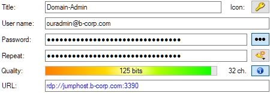
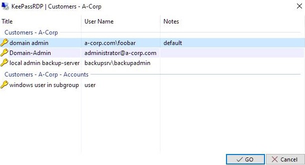
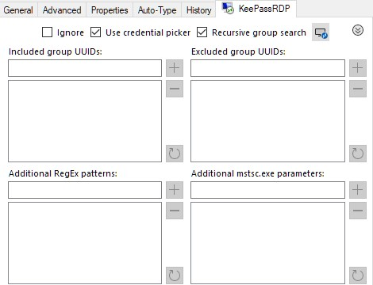
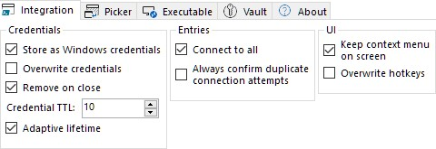

[latest]: https://github.com/iSnackyCracky/KeePassRDP/releases/latest/download/KeePassRDP_v2.0.zip

# KeePassRDP
[](https://github.com/iSnackyCracky/KeePassRDP/releases/latest)
[][latest]

[](COPYING)


## Overview
KeePassRDP is a plugin for KeePass 2.x which adds various options to connect to the URL of an entry via RDP.

## Installation
1. Download the .zip file for the latest <sub>[][latest]</sub>.
2. Unzip and copy the KeePassRDP.plgx file to your KeePass plugins folder *`(e.g. C:\Program Files\KeePass Password Safe 2\Plugins)`*.
3. Start KeePass and enjoy using KeePassRDP.

## Usage
To connect to target computers via RDP select one or more entries containing the IP-address(es) or hostname(s), right-click and select `KeePassRDP > Open RDP connection` (or simply press <kbd>CTRL</kbd> + <kbd>M</kbd>).

>

To use one of the other connection options select the corresponding item from the context menu, or press the configurable keyboard shortcut.

## Features
- Connect to host via RDP
- Connect to host via RDP admin session (`mstsc.exe /admin` parameter)
- Support for `mstsc.exe` parameters (`/f`, `/span`, `/multimon`, `/w`, `/h`, `/public`, `/restrictedAdmin`, `/remoteGuard`)
- Select from matching (Windows or domain) credentials when the target entry is inside a configurable trigger group ([see below](#trigger-group--folder))
- Automatic adding and removing of credentials to and from the Windows credential manager ([how it works](#how-it-works))
- Configurable [keyboard shortcuts](#keyboard-shortcuts)
- Configurable [context menu](#context-menu--toolbar-items)
- Configurable [toolbar items](#context-menu--toolbar-items)
- Configurable [credential lifetime](#credential-lifetime)
- Customizable [credential picker](#credential-picker)
- Customizable [per entry settings](#individual-entry-settings)
- Support for DPI-scaling
- Made with :heart: and :pizza:

## Languages
<sub></sub> English
| <sub></sub> German

<br>

### Trigger group / folder
This is how we use the extension on a daily basis (I work for an MSP where we use KeePass to securely store credentials for accessing customer domains and computers):

Our KeePass database is structured like that:

>

Where each group contains entries specific to that customer.

If there is only a single jumphost or something similiar, we usually place an entry like the following directly in the customer group:

>

When a customer has many hosts and/or requires multiple accounts, we create a subgroup called **RDP** inside the customer group:

>

>><small>The name of the trigger group can be configured from within the KeePassRDP options form *(since v2.0)*.</small>

It may contain entries like this:

>

Credentials are taken from the customer group in that case (by default they can also be in different subgroups within the customer group):

>

>><small>Ignoring entries can be toggled via the KeePassRDP context menu *(since v1.9.0)* or from the toolbar *(since v2.0)*.</small>

To connect to one of the targets in the **RDP** group (using credentials), just select the entry, press <kbd>CTRL</kbd> + <kbd>M</kbd> and KeePassRDP will show a dialog with filtered account entries (matching the titles by a configurable regular expression, *e.g. domain-admin, local user, ...*).

>

Finally you only need to select the credential you want to use and click "GO" (or press <kbd>Enter</kbd>).

<br>

><small id="individual-entry-settings">Individual entry settings can be set from the KeePassRDP tab on the edit entry form *(since v2.0)*.</small>
>
>>

### Keyboard shortcuts

>Fully configurable from within the KeePassRDP options form.
>
>>

### Context menu / toolbar items

>Visibility configurable from within the KeePassRDP options form.
>
>>

### Credential picker

>Customizable from within the KeePassRDP options form.
>
>>

## How it works
Basically the plugin calls the default `mstsc.exe` with the `/v:<address>` (and optionally other) parameter(s) to connect.

If you choose to open a connection ***with credentials*** it stores the selected credentials into the Windows credential manager ("vault") for usage by the `mstsc.exe` process.

The credentials will then be removed depending on what is configured in the KeePassRDP options.

### Credential lifetime

>Configurable from within the KeePassRDP options form.
>
>>

## Third-party software
KeePassRDP makes use of the following third-party libraries:
- the *awesome* [**Json.NET**](https://github.com/JamesNK/Newtonsoft.Json) by James Newton-King
- [**Visual Studio 2022 Image Library**](https://www.microsoft.com/en-us/download/details.aspx?id=35825) by Microsoft

## Building instructions
Just clone the repository:

```bash
git clone https://github.com/iSnackyCracky/KeePassRDP.git
```

Open the solution file (KeePassRDP.sln) with Visual Studio and build the KeePassRDP project:

>

You should get a ready-to-use .plgx and .zip file like the ones from the releases.
